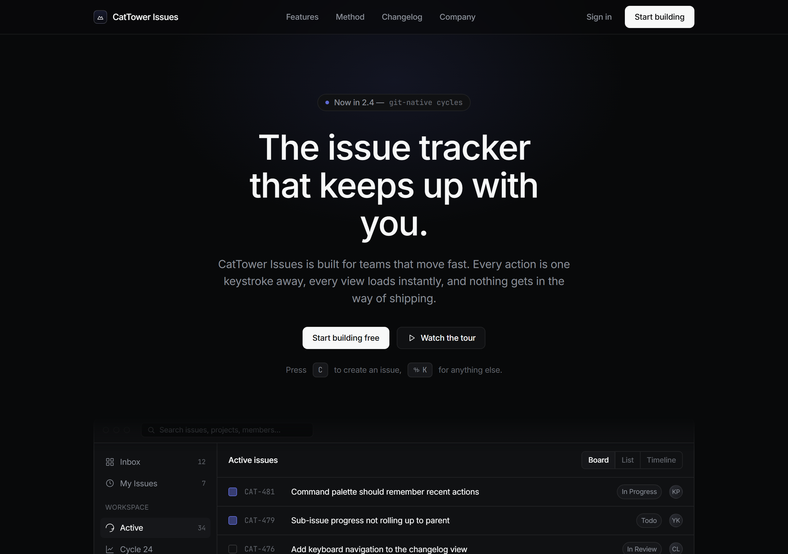

<p align="center">
  
</p>
<p align="center">
  
  
  
</p>

# theme-park.md

AI-generated pages are ugly and all look the same. These specs fix that: deliberate colors and layout, and less AI-looking output — no emojis (~~🚀~~ ~~✨~~ ~~🎉~~ ~~🔥~~ ~~✅~~), line-style SVG icons instead.

Each `themes/*.md` is a self-contained spec: color tokens, typography, layout, components, motion, and a Don't list.

## Before / After

Same content, restyled with a theme — a plain page becomes a deliberate one.

You can turn this
<p align="center"></p>
into this
<table>
<tr>
<td width="59%"></td>
<td width="41%"></td>
</tr>
</table>

## Themes

| Theme | Visual character |
|---|---|
| `themes/gradient-canvas.md` | Light, one animated gradient moment, diagonal cuts |
| `themes/dark-precision.md` | Dark-only, typographic precision, border-based depth |
| `themes/mono-grid.md` | Black/white geometry, exposed line grid, mono artifacts |
| `themes/warm-workspace.md` | Warm white, cards and toggles, one calm accent |
| `themes/scroll-story-blue.md` | Mobile-first full-screen scroll narrative, single blue |
| `themes/editorial-hairline.md` | Warm off-white, hairline rules, serif-italic accents |
| `themes/bold-twotone.md` | One deep + one bright tone, condensed display type |
| `themes/quiet-paper.md` | Paper tones, long-form copy, radius 0, zero urgency |
| `themes/spec-minimal.md` | Monochrome, oversized spec numerals, uppercase labels |
| `themes/mono-editorial-shop.md` | B/W editorial commerce, mixed Latin/Korean type |
| `themes/midnight.md` | Dark navy engineering UI, single ice-blue accent, border depth |
| `themes/phosphor.md` | Green CRT terminal, bitmap type, working TTY |
| `themes/violet-phosphor.md` | Violet CRT terminal variant, live monitor and shell |
| `themes/grainy-blur.md` | Dark charcoal canvas, blurred color light-curtains, heavy film grain |
| `themes/calm-pastel.md` | Warm paper canvas, super-rounded pastel surfaces, breathing motion |
| `themes/dark-glass.md` | Near-black frosted glass, hairline highlights, single violet glow |
| `themes/scrolly-data.md` | Light scroll-driven data essay, serif editorial voice, live charts |
| `themes/lab-console.md` | Light engineering console, dense tables, run metrics |
| `themes/brutalist-pop.md` | Black poster-size grotesque, single orange pop, marquee bands |
| `themes/kinetic-type.md` | White canvas, oversized grotesque + serif italic, scroll-driven type |
| `themes/playful-blocks.md` | Saturated color chips, chunky 3D-lip buttons, springy motion |
| `themes/dense-grid-shop.md` | High-density product grid, b/w chrome, one warm red for prices |
| `themes/tech-blue.md` | Sky-tint campaign commerce UI, single cobalt accent |
| `themes/orange-offset-mono.md` | Offset black headline blocks on gray, mono labels, stair motif |
| `themes/lego-effect-design.md` | Studded brick components, hard shadows, toy-grid baseplate |
| `themes/dark-editorial-scroll.md` | Near-black editorial scroll, sticky title column, warm gradient imagery |

## Previews

Each theme below was built into a single self-contained HTML page from its spec alone — fictional content, line-style icons, no emoji. The caption under each preview links to the spec it was built from.

<table>
<tr>
<td width="50%"><br><sub><a href="themes/gradient-canvas.md">themes/gradient-canvas.md</a></sub></td>
<td width="50%"><br><sub><a href="themes/dark-precision.md">themes/dark-precision.md</a></sub></td>
</tr>
<tr>
<td><br><sub><a href="themes/mono-grid.md">themes/mono-grid.md</a></sub></td>
<td><br><sub><a href="themes/warm-workspace.md">themes/warm-workspace.md</a></sub></td>
</tr>
<tr>
<td><br><sub><a href="themes/scroll-story-blue.md">themes/scroll-story-blue.md</a></sub></td>
<td><br><sub><a href="themes/editorial-hairline.md">themes/editorial-hairline.md</a></sub></td>
</tr>
<tr>
<td><br><sub><a href="themes/bold-twotone.md">themes/bold-twotone.md</a></sub></td>
<td><br><sub><a href="themes/quiet-paper.md">themes/quiet-paper.md</a></sub></td>
</tr>
<tr>
<td><br><sub><a href="themes/spec-minimal.md">themes/spec-minimal.md</a></sub></td>
<td><br><sub><a href="themes/mono-editorial-shop.md">themes/mono-editorial-shop.md</a></sub></td>
</tr>
<tr>
<td><br><sub><a href="themes/midnight.md">themes/midnight.md</a></sub></td>
<td><br><sub><a href="themes/phosphor.md">themes/phosphor.md</a></sub></td>
</tr>
<tr>
<td><br><sub><a href="themes/violet-phosphor.md">themes/violet-phosphor.md</a></sub></td>
<td><br><sub><a href="themes/grainy-blur.md">themes/grainy-blur.md</a></sub></td>
</tr>
<tr>
<td><br><sub><a href="themes/calm-pastel.md">themes/calm-pastel.md</a></sub></td>
<td><br><sub><a href="themes/dark-glass.md">themes/dark-glass.md</a></sub></td>
</tr>
<tr>
<td><br><sub><a href="themes/scrolly-data.md">themes/scrolly-data.md</a></sub></td>
<td><br><sub><a href="themes/lab-console.md">themes/lab-console.md</a></sub></td>
</tr>
<tr>
<td><br><sub><a href="themes/brutalist-pop.md">themes/brutalist-pop.md</a></sub></td>
<td><br><sub><a href="themes/kinetic-type.md">themes/kinetic-type.md</a></sub></td>
</tr>
<tr>
<td><br><sub><a href="themes/tech-blue.md">themes/tech-blue.md</a></sub></td>
<td><br><sub><a href="themes/orange-offset-mono.md">themes/orange-offset-mono.md</a></sub></td>
</tr>
<tr>
<td><br><sub><a href="themes/lego-effect-design.md">themes/lego-effect-design.md</a></sub></td>
<td><br><sub><a href="themes/dark-editorial-scroll.md">themes/dark-editorial-scroll.md</a></sub></td>
</tr>
<tr>
<td><br><sub><a href="themes/playful-blocks.md">themes/playful-blocks.md</a></sub></td>
<td><br><sub><a href="themes/dense-grid-shop.md">themes/dense-grid-shop.md</a></sub></td>
</tr>
</table>

> [!NOTE]
> Previews are above-the-fold screenshots rendered at 1280px.

## Usage

```
git clone https://github.com/<you>/theme-park.md ~/theme-park.md
```

Then, from any project, prompt your assistant:

> Build the page as a single HTML file.
> Follow `~/theme-park.md/themes/dark-precision.md` exactly, including the Don't section.

Optionally pin a theme to a project: `cp ~/theme-park.md/themes/dark-precision.md ./DESIGN.md` — then "follow DESIGN.md" is the whole prompt.

> [!IMPORTANT]
> One theme per page. Mixing two defeats the purpose.

## Rules baked into every theme

- No emojis — line-style SVG icons only (Lucide, ISC)
- Open-licensed fonts only (SIL OFL), referenced by CDN
- Some colors are deliberately offset from brand-identifying hues

## Disclaimer & License

> [!NOTE]
> Independent design-pattern study. Not affiliated with any company; no brand assets included; all demo content fictional (except my profile).

Docs: CC BY 4.0 · Code samples: MIT